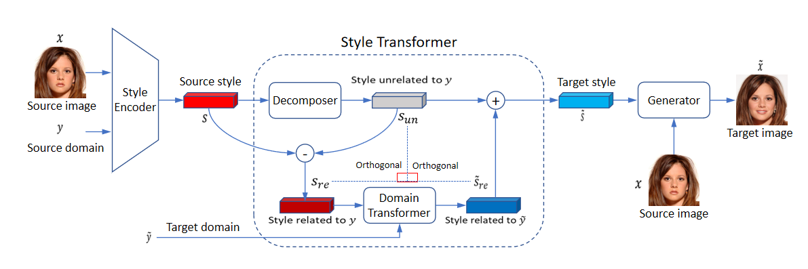

## L2M-GAN - Official PyTorch Implementation

<p align="left"></p>

> [**L2M-GAN: Learning to Manipulate Latent Space Semantics for Facial Attribute Editing**](https://openaccess.thecvf.com/content/CVPR2021/papers/Yang_L2M-GAN_Learning_To_Manipulate_Latent_Space_Semantics_for_Facial_Attribute_CVPR_2021_paper.pdf) (CVPR 2021, Oral)<br>
> Guoxing Yang, Nanyi Fei, Guangzhen Liu, Zhiwu Lu, Mingyu Ding, Tao Xiang<br>

> **Abstract:** *A deep facial attribute editing model strives to meet two requirements: (1) attribute correctness -- the target attribute should correctly appear on the edited face image; (2) irrelevance preservation -- any irrelevant information (e.g., identity) should not be changed after editing. Meeting both requirements challenges the state-of-the-art works which resort to either spatial attention or latent space factorization. Specifically, the former assume that each attribute has well-defined local support regions; they are often more effective for editing a local attribute than a global one. The latter factorize the latent space of a fixed pretrained GAN into different attribute-relevant parts, but they cannot be trained end-to-end with the GAN, leading to sub-optimal solutions. To overcome these limitations, we propose a novel latent space factorization model, called L2M-GAN, which is learned end-to-end and effective for editing both local and global attributes. The key novel components are: (1) A latent space vector of the GAN is factorized into an attribute-relevant and irrelevant codes with an orthogonality constraint imposed to ensure disentanglement. (2) An attribute-relevant code transformer is learned to manipulate the attribute value; crucially, the transformed code are subject to the same orthogonality constraint. By forcing both the original attribute-relevant latent code and the edited code to be disentangled from any attribute-irrelevant code, our model strikes the perfect balance between attribute correctness and irrelevance preservation. Extensive experiments on CelebA-HQ show that our L2M-GAN achieves significant improvements over the state-of-the-arts.*

<p align="left"></p>

## Requirements
Install the dependencies:
```bash
conda create -n virtual python=3.6.7
conda activate virtual
conda install -y pytorch=1.7.1 torchvision=0.8.2 cudatoolkit=10.0 -c pytorch
conda install x264=='1!152.20180717' ffmpeg=4.0.2 -c conda-forge
pip install opencv-python==4.1.2.30 ffmpeg-python==0.2.0 scikit-image==0.16.2
pip install pillow==7.0.0 scipy==1.2.1 tqdm==4.43.0 munch==2.5.0
```

## Datasets and pre-trained networks
We provide the link of baidu disk to download datasets used in L2M-GAN and the corresponding pre-trained networks. The [datasets](https://pan.baidu.com/s/1QuSeUwzHPMG2UFIzIbHbtw ) and [network checkpoints](https://pan.baidu.com/s/1iVgVR-ljh3L4NYo9yqlDDw ) should be downloaded and stored in the `data` and `expr/checkpoints` directories, respectively.

The extract code for dataset : ul1o

The extract code for checkpoints : cka0

## Evaluation metrics
To evaluate L2M-GAN using [Fr&eacute;chet Inception Distance (FID)](https://arxiv.org/abs/1706.08500) , run the following commands:


```bash
CUDA_VISIBLE_DEVICES=[gpu_id] python main.py --num_domains 2 --w_hpf 1 --resume_iter 100000 --train_img_dir [train_img_path] --val_img_dir [val_img_path] --checkpoint_dir [ckpt_path] --eval_dir [eval_result_path] --degree [degree number]
```

an example is : 
```bash
CUDA_VISIBLE_DEVICES=0 python main.py --mode eval --num_domains 2 --w_hpf 1 --resume_iter 100000 --train_img_dir data/celeba_hq/train --val_img_dir data/celeba_hq/val --checkpoint_dir /expr/checkpoints --eval_dir expr/eval
```

## Citation
If this repo helps in your work, please cite the following paper:

```
@InProceedings{Yang_2021_CVPR,
    author    = {Yang, Guoxing and Fei, Nanyi and Ding, Mingyu and Liu, Guangzhen and Lu, Zhiwu and Xiang, Tao},
    title     = {{L2M-GAN}: Learning To Manipulate Latent Space Semantics for Facial Attribute Editing},
    booktitle = {Proceedings of the IEEE/CVF Conference on Computer Vision and Pattern Recognition (CVPR)},
    year      = {2021},
    pages     = {2951-2960}
}
```
